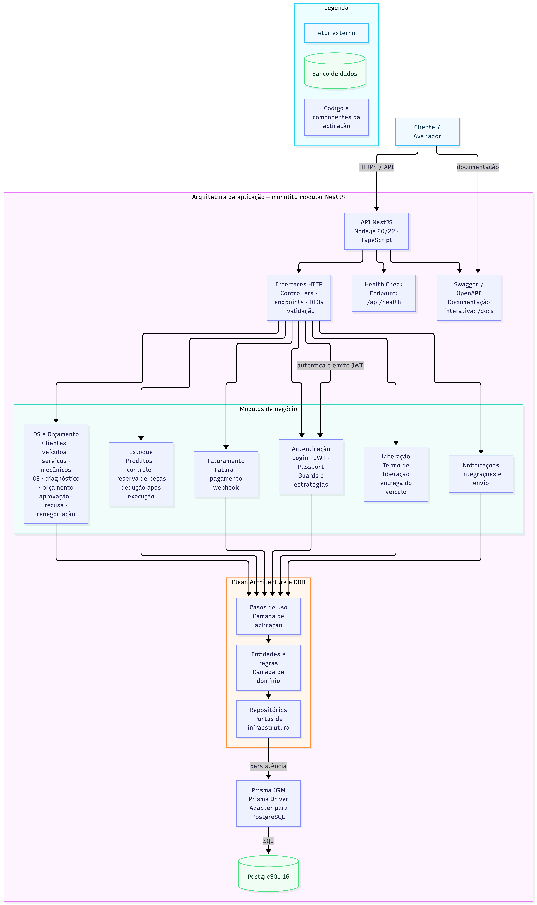
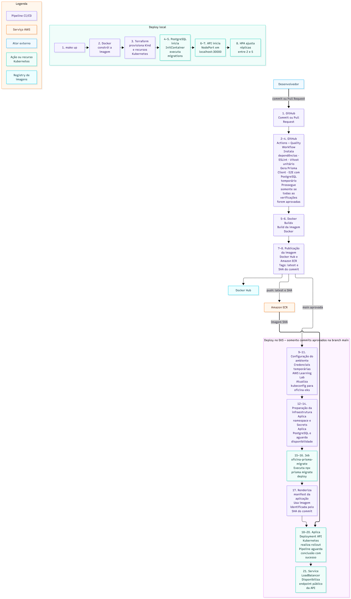

# 🛠️ FIAP Tech Challenge - Oficina Mecânica
---

## 📖 Sobre o Projeto
Este projeto implementa uma API backend robusta para o domínio de uma oficina mecânica, com foco em processos operacionais críticos como criação de ordens de serviço, diagnóstico técnico, geração automática de orçamento, aprovação ou recusa do cliente, reserva de peças em estoque, execução do serviço, faturamento e liberação do veículo para entrega.

A solução foi estruturada com uma abordagem modular e orientada a domínios, permitindo crescimento incremental sem acoplar demais regras de negócio à infraestrutura. O sistema também incorpora autenticação JWT para rotas administrativas e expõe uma documentação interativa via Swagger.

## 🎯 Objetivos da Fase

Esta fase tem como objetivo preparar a solução para execução, escalabilidade e operação em ambientes conteinerizados e Kubernetes, mantendo a separação entre regras de negócio e infraestrutura.

Os principais objetivos são:

- **Conteinerizar a aplicação:** disponibilizar imagens Docker reproduzíveis para desenvolvimento e produção, com um Dockerfile multi-stage.
- **Orquestrar os componentes:** executar a API NestJS e o PostgreSQL em Kubernetes, com Services, ConfigMaps, Secrets, probes de saúde e namespaces dedicados.
- **Automatizar o provisionamento:** utilizar Terraform em `src/infra/terraform` para provisionar o ambiente Kubernetes local baseado em Kind.
- **Aplicar escalabilidade:** configurar múltiplas réplicas e Horizontal Pod Autoscaler para ajustar a capacidade da API conforme o consumo de recursos.
- **Automatizar o ciclo de entrega:** executar lint, testes unitários, testes e2e, build e publicação da imagem por meio dos workflows do GitHub Actions.
- **Executar em ambiente AWS:** disponibilizar um fluxo de deploy no Amazon EKS Learning Lab, utilizando ECR, manifests Kubernetes e migrations automatizadas do Prisma.
- **Garantir operabilidade:** expor health checks, logs, documentação Swagger e comandos padronizados no Makefile para subir, atualizar, consultar e remover os ambientes.

O ambiente local com Kind é utilizado para desenvolvimento e validação rápida. O fluxo AWS EKS é utilizado para demonstrar a execução da mesma aplicação em um cluster Kubernetes gerenciado. No Learning Lab, o PostgreSQL utiliza armazenamento efêmero devido às permissões disponíveis para o driver EBS; para produção, recomenda-se utilizar Amazon RDS ou uma configuração persistente com as políticas IAM adequadas.

---

## 🚀 Tecnologias Utilizadas


### Categorias
- **Linguagem & Runtime:** Node.js, TypeScript
- **Framework & Core:** NestJS, Express, Passport JWT
- **Banco de Dados & ORM:** PostgreSQL, Prisma ORM, Prisma Driver Adapter para PostgreSQL
- **Documentação:** Swagger / OpenAPI
- **Testes & Qualidade:** Vitest, ESLint

---

## 🏗️ Arquitetura e Estrutura de Pastas
A aplicação segue um padrão arquitetural modular com forte separação entre módulos de negócio, casos de uso, controladores e infraestrutura. A organização é inspirada em princípios de Clean Architecture e DDD, com cada contexto encapsulando suas regras e integrações.

### Diagramas da solução

Os diagramas abaixo apresentam a arquitetura da aplicação, a infraestrutura Kubernetes provisionada e o fluxo de deploy:

#### Arquitetura da aplicação



#### Infraestrutura Kubernetes e AWS


#### Fluxo de deploy



### Estrutura representativa
```text
src/
├── core/                         # Núcleo compartilhado de domínio
│   ├── entities/                 # Entidades, agregados e listas observadas
│   ├── errors/                   # Erros de domínio e de casos de uso
│   ├── events/                   # Eventos de domínio
│   ├── repositories/             # Contratos de repositórios
│   ├── types/                    # Tipos compartilhados
│   └── either.ts                 # Resultado de sucesso ou erro
├── generated/                    # Código gerado pelo Prisma
├── infra/                        # Adaptadores e integrações de infraestrutura
│   ├── auth/                     # Estratégias e guards de autenticação
│   ├── cryptography/             # Serviços de criptografia
│   ├── database/                 # Módulo de banco e integração com Prisma
│   ├── gateways/                 # Gateways para serviços externos
│   ├── health/                   # Health checks da aplicação
│   ├── http/                     # Módulo HTTP, DTOs, erros e presenters
│   ├── nest/                     # Módulo raiz e configuração do NestJS
│   ├── terraform/                # Infraestrutura como código para o Kind
│   └── main.ts                   # Bootstrap da aplicação
├── modules/                      # Módulos e contextos de negócio
│   ├── autenticacao/             # Login e autenticação JWT
│   ├── estoque/                  # Produtos, estoque e reservas
│   ├── faturamento/              # Faturamento e webhook de pagamento
│   ├── liberacao/                # Termo de liberação e entrega
│   ├── notificacoes/             # Integração de notificações
│   └── os-orcamento/             # Clientes, veículos, OS e orçamentos
├── shared/                       # Componentes compartilhados da aplicação
│   └── domain/                   # Elementos compartilhados de domínio
└── teste/                        # Helpers para testes
```

### Padrão de organização
- **Modules:** representam os bounded contexts do negócio.
- **Controllers:** expõem os endpoints HTTP.
- **DTOs:** definem contratos de entrada e saída da API.
- **Infra:** concentra a integração com NestJS, Prisma, autenticação e documentação.
- **Prisma Schema:** define o modelo relacional e as relações entre clientes, veículos, serviços, produtos, ordens de serviço e faturamento.

---

## ✨ Funcionalidades Principais
- Criação e acompanhamento de ordens de serviço.
- Cadastro de clientes, veículos, serviços, mecânicos e recepcionistas.
- Geração automática de orçamento após o diagnóstico técnico.
- Aprovação, recusa e renegociação de orçamento.
- Reserva e controle de estoque de peças e insumos.
- Finalização de execução da OS e dedução automática de estoque.
- Emissão de fatura e webhook de confirmação de pagamento.
- Geração de termo de liberação e fluxo de entrega do veículo.
- Métricas de tempo médio de execução de ordens de serviço.
- Autenticação JWT para áreas administrativas.

---

## 🚀 Infraestrutura, Kubernetes & CI/CD

A infraestrutura completa da aplicação utiliza **Kubernetes (Kind)**, **Terraform (IaC)**, **InitContainers** para migrações automatizadas via Prisma e **Horizontal Pod Autoscaler (HPA)**. 

Para instruções detalhadas de como subir o ambiente localmente via Makefile, configurar o Terraform, publicar no AWS EKS Learning Lab ou entender os workflows de CI/CD, consulte o nosso [Guia de Infraestrutura e DevOps](./docs/INFRASTRUCTURE.md).

## 🏗️ Infraestrutura Provisionada

O projeto possui dois alvos de execução Kubernetes: um ambiente local baseado em Kind, utilizado para desenvolvimento e validação, e um ambiente AWS EKS utilizado para demonstrar a execução em um cluster gerenciado. Os dois ambientes executam a mesma API, mas utilizam formas diferentes de exposição e provisionamento.

### Infraestrutura local

O ambiente local é executado com Docker, Kind e Kubernetes:

- Docker executa os containers e o cluster Kind.
- O cluster `oficina-cluster` possui um nó de control plane.
- O namespace `oficina-mecanica` isola os recursos da aplicação.
- A API roda em um Deployment com duas réplicas.
- O PostgreSQL roda em um Deployment com Service interno.
- O Service `oficina-service` utiliza `NodePort` na porta `30000`.
- ConfigMap e Secret fornecem as configurações da aplicação.
- O HPA permite escalar a API conforme CPU e memória.
- O InitContainer executa `prisma migrate deploy` antes da API iniciar.

Os recursos locais podem ser criados com:

```bash
make up
```

### Infraestrutura provisionada pelo Terraform

Os scripts Terraform estão em [src/infra/terraform](src/infra/terraform) e provisionam o ambiente local baseado em Kind. A responsabilidade está dividida em módulos:

- `modules/cluster`: cria o cluster Kind e o mapeamento da porta `30000`.
- `modules/database`: cria o Deployment e o Service do PostgreSQL.
- `modules/app`: cria Secret, Deployment, Service e HPA da API.
- `main.tf`: conecta os módulos e cria o namespace `oficina-mecanica`.

O fluxo manual é:

```bash
cd src/infra/terraform
cp terraform.tfvars.example terraform.tfvars
terraform init
terraform plan -out=tfplan
terraform apply tfplan
```

Antes de aplicar, revise o `terraform.tfvars` e substitua os valores de exemplo. Esse arquivo e o plano `tfplan` são locais e não devem ser versionados.

O Terraform deste diretório não cria o EKS. O cluster AWS é criado separadamente pelo `eksctl`, conforme descrito abaixo.

### Infraestrutura AWS EKS do Learning Lab

O fluxo EKS usa [eksctl.yaml](eksctl.yaml), [scripts/deploy-eks.sh](scripts/deploy-eks.sh) e os manifests em [k8s/eks](k8s/eks):

- `eksctl` cria o cluster EKS e utiliza as roles IAM fornecidas pelo Learning Lab.
- Amazon ECR armazena a imagem Docker de produção.
- O namespace `oficina-mecanica` agrupa os recursos da aplicação.
- O Deployment executa duas réplicas da API.
- O Service `oficina-service` utiliza `LoadBalancer` para expor a API.
- O HPA permite escalar a API de duas a quatro réplicas.
- Um Job executa as migrations do Prisma antes do rollout da API.
- O PostgreSQL roda em um StatefulSet dentro do namespace.

O manifesto [k8s/eks/app.yaml](k8s/eks/app.yaml) contém o `ConfigMap`, o `Deployment`, o `Service` `LoadBalancer` e o HPA, que escala por CPU e memória. Os Secrets não armazenam valores no Git: o script [scripts/deploy-eks.sh](scripts/deploy-eks.sh) cria `oficina-db-secret` e `oficina-app-secret` a partir das variáveis fornecidas pelo workflow ou pelo terminal. O mesmo script instala o Metrics Server e aguarda seu rollout para disponibilizar a API `metrics.k8s.io` ao HPA.

O deploy também carrega dados demonstrativos para facilitar a avaliação. No Kind, `make up` executa o seed ao final da criação do ambiente; no EKS, o Job `oficina-prisma-seed` é executado apenas uma vez e preservado nos deploys seguintes. As credenciais demonstrativas são `admin@oficina.com` / `senha123` e `maria.recepcao@oficina.com` / `senha123`. O seed é destrutivo e deve ser executado novamente somente quando for desejado resetar os dados.

Os comandos principais são:

```bash
make eks-up       # cria o cluster e publica a primeira versão
make eks-deploy   # publica uma nova versão em um cluster existente
make eks-down     # remove o cluster e evita custos no Learning Lab
```

### Limitação do PostgreSQL com `emptyDir`

No Learning Lab, o PostgreSQL utiliza `emptyDir` em [k8s/eks/postgres.yaml](k8s/eks/postgres.yaml). Essa decisão é específica do laboratório: a role dos nodes não possui as permissões necessárias para que o EBS CSI crie volumes persistentes.

Consequências:

- Os dados permanecem disponíveis enquanto o Pod estiver ativo.
- A recriação ou movimentação do Pod pode apagar os dados do banco.
- O `emptyDir` não deve ser utilizado como armazenamento de produção.
- O `make eks-deploy` pode recriar o StatefulSet durante a atualização do ambiente.

Para um ambiente real, a recomendação é utilizar Amazon RDS para PostgreSQL ou habilitar corretamente o EBS CSI com uma role que possua as políticas necessárias, incluindo `AmazonEBSCSIDriverPolicy`. Essa limitação não afeta a demonstração da API, das migrations e da integração Kubernetes, mas deve ser apresentada explicitamente como uma decisão de escopo do Learning Lab.

---

## 🔄 Fluxo de Deploy

O projeto possui fluxos de deploy distintos para o ambiente local e para o AWS EKS. Em ambos, a imagem Docker de produção é executada no Kubernetes, as migrations do Prisma são aplicadas antes da API e o rollout é validado por probes no endpoint `/api/health`.

### Deploy local com Kind e Terraform

```text
Código-fonte
    -> docker build
Imagem Docker no Docker Hub
    -> Terraform
Cluster Kind + namespace + PostgreSQL + API + HPA
    -> InitContainer
Migrations Prisma
    -> Deployment/Service
API disponível em http://localhost:30000
```

Execução automatizada:

```bash
make up
```

Esse comando constrói e publica a imagem, executa o `terraform apply`, aguarda o Deployment da API e disponibiliza o Service `NodePort` na porta `30000`. Para atualizar somente a aplicação:

```bash
make build
```

Para remover o ambiente local:

```bash
make down
```

### Deploy no AWS EKS Learning Lab

```text
Código-fonte
    -> docker build --target production
Imagem versionada no Amazon ECR
    -> eksctl/kubectl
Cluster EKS + namespace + Secrets + PostgreSQL + API + HPA
    -> Job oficina-prisma-migrate
Migrations Prisma
    -> Deployment/LoadBalancer
API disponível pelo hostname público da AWS
```

Para criar o cluster e publicar a primeira versão:

```bash
make eks-up
```

O script `scripts/deploy-eks.sh` obtém a conta AWS, localiza as roles fornecidas pelo Learning Lab, cria o cluster com `eksctl`, cria o repositório ECR, publica a imagem e aplica os manifests em `k8s/eks`.

Com o cluster existente, novas versões são publicadas com:

```bash
make eks-deploy
```

Esse fluxo atualiza o kubeconfig, publica uma imagem identificada pelo commit, atualiza os Secrets, recria o PostgreSQL efêmero do laboratório, executa o Job de migrations e aguarda o rollout da API. O endereço de acesso pode ser consultado com:

```bash
kubectl get service oficina-service -n oficina-mecanica
```

Para acessar a documentação Swagger durante a demonstração, inclusive quando o acesso público aos assets apresentar instabilidade:

```bash
kubectl port-forward -n oficina-mecanica service/oficina-service 8080:80
```

Depois, abra `http://localhost:8080/docs/`. O port-forward é temporário e não altera a exposição do Service no EKS.

Ao finalizar o uso do Learning Lab:

```bash
make eks-down
```

### Pipeline de qualidade e publicação

O GitHub Actions executa o fluxo abaixo:

1. `quality.yml` executa lint, testes unitários e testes e2e com PostgreSQL.
2. Após o sucesso da qualidade na branch principal, `docker-build.yml` constrói a imagem de produção.
3. A imagem é publicada no Docker Hub com as tags `latest` e o SHA do commit.
4. O deploy no EKS é acionado manualmente pelo `make eks-deploy`, usando as credenciais temporárias do Learning Lab.

O workflow atual automatiza qualidade, build e publicação da imagem, mas não utiliza as credenciais temporárias do Learning Lab para fazer deploy no EKS. Para automatizar também essa última etapa em um ambiente permanente, seria necessário configurar uma role AWS com OIDC para o GitHub Actions.

---

## ▶️ Como Executar o Projeto
### Pré-requisitos
- Node.js 20+
- Docker e Docker Compose
- npm ou pnpm

### 1) Clone e configure as variáveis de ambiente
Crie o arquivo `.env` na raiz do projeto com base no arquivo de exemplo:
```bash
cp .env.example .env
```

### 2) Suba o ambiente local

O `.env.example` já contém valores locais para o PostgreSQL principal, o banco de testes e o SonarQube. Antes de subir os serviços, revise pelo menos:

- `POSTGRES_USER`, `POSTGRES_PASSWORD` e `POSTGRES_DB`: credenciais e nome do banco principal.
- `DATABASE_URL`: conexão usada pela aplicação local.
- `POSTGRES_TEST_*`: configuração do banco utilizado pelos testes e2e.
- `SONAR_*`: configuração opcional do SonarQube.

Não utilize credenciais de produção no `.env` local e não versione esse arquivo.

```bash
docker compose up -d --build
```

### 3) Aplique as migrations e seed inicial
```bash
docker compose exec app npx prisma generate
docker compose exec app npx prisma migrate deploy
docker compose exec app npm run db:seed
```

A API ficará disponível em:
- API base: http://localhost:3000/api
- Swagger: http://localhost:3000/docs

---

## 📚 Documentação da API (Swagger)
A documentação interativa da API está disponível no endpoint Swagger em:

```text
http://localhost:3000/docs
```

A aplicação também utiliza o prefixo global `/api` para todos os endpoints, e a documentação cobre os módulos de autenticação, ordens de serviço, estoque, faturamento, liberação e notificações.

---

## 🧪 Rodando os Testes
O projeto conta com testes unitários, testes e2e e relatórios de cobertura.

### Testes unitários
```bash
npm test
```

### Cobertura
```bash
npm run test:cov
```

### Testes e2e
```bash
npm run test:e2e
```

### UI de cobertura
```bash
npm run test:all:ui
```

---

## ✅ SonarQube
Este projeto inclui integração com SonarQube para análise de qualidade de código e cobertura.

### Pré-requisitos
- SonarQube rodando localmente em `http://localhost:9000` ou outro host acessível
- `SONAR_TOKEN` configurado no arquivo `.env` ou variável de ambiente
- Node.js instalado e dependências do projeto instaladas

### Executando a análise
```bash
npm run sonar
```

### Variáveis de ambiente úteis
```bash
SONAR_HOST_URL=http://localhost:9000
SONAR_TOKEN=<seu-token-sonarqube>
```

A análise usa a configuração de cobertura em `coverage/lcov.info` e as fontes de `src`.

---

## 📄 Licença
Este projeto está licenciado sob a licença ISC, conforme informado no arquivo de configuração do pacote.
